# Мобильное приложение «Тревога в ГБР»
РУКОВОДСТВО ПОЛЬЗОВАТЕЛЯ

## Введение
Приложение «Тревога в ГБР» разработано компанией «Си-Норд» и предназначено для использования группами быстрого реагирования частных охранных предприятий (далее по тексту – группы быстрого реагирования ЧОП, ГБР ЧОП, ГБР).

Использование приложения позволяет сотрудникам ГБР выполнять следующие основные функции:

- принятие тревожного вызова на объект от оператора «Центра охраны»;
- подтверждение прибытия ГБР на объект;
- просмотр карточки объекта, включающей в себя информацию о состоянии объекта, о шлейфах на объекте, об ответственных за объект лицах, а также фотографии объекта и его местоположение на интерактивной карте Яndex;
- подтверждение выполнения отмены вызова на объект.

Настоящее руководство пользователя содержит основные сведения о назначении и принципах работы приложения «Тревога в ГБР», подробное описание функциональных возможностей и действий, необходимых для обеспечения эффективной работы пользователя.

----------
Компания «Си-Норд» оставляет за собой право вносить изменения в программное обеспечение и документацию без предварительного извещения пользователей приложения «Тревога в ГБР». 

При возникновении вопросов и для получения дополнительной информации обращайтесь в службу технической поддержки компании «Си-Норд» по телефону (812) 327-16-36, доб. 2 или по электронной почте [support@cnord.ru](mailto:support@cnord.ru).

----------

## Требования к программному и аппаратному обеспечению планшетного компьютера

Приложение «Тревога в ГБР»  устанавливается на планшетный компьютер группы быстрого реагирования ЧОП. 

Требования к планшетному компьютеру ГРБ:

- Операционная система: Android 4.0 и выше;
- Минимальное разрешение экрана: 1024х600;
- Обязательно наличие GSM-модема для подключения к интернету;
- Обязательно наличие GPS.

Пример подходящего планшета: ***Samsung Galaxy Tab 2 7.0 P3100***.

Кроме вышеперечисленного для работы приложения необходимо программное обеспечение «Андромеда Центр охраны» версии 4.2, которое подключено к "[Облаку](https://cloud.cnord.net/)" в режиме использования всех облачных сервисов. Подробнее узнать о том, как подключить программное обеспечение "Центр охраны" к "Облаку", а также о возможных режимах использования "Облака" можно из документации на "Центр охраны".  

## Подготовка к работе с приложением  

Перед началом установки приложения необходимо проверить, соответствуют ли программно-аппаратные возможности планшетного компьютера ГБР требованиям, изложенным в разделе «Требования к программному и аппаратному обеспечению планшетного компьютера» настоящего руководства.

Для подготовки к работе с приложением «Тревога в ГБР» необходимо выполнить следующие шаги:

* установить ПО «Андромеда Центр охраны» версии 4.2 (или выше) и подключить его к "Облаку" в режиме использования всех облачных сервисов;
* зарегистрировать аккаунт партнера в «Облаке», используя идентификатор (UID) "Центра охраны": [https://cloud.cnord.net/](https://cloud.cnord.net/);
* установить приложения «Тревога в ГБР» из Google Play Market: [https://play.google.com/store/apps/details?id=com.cnord.gbr_tablet](https://play.google.com/store/apps/details?id=com.cnord.gbr_tablet).

### Получение пароля для доступа к приложению

Просмотр и управление паролями для авторизации в приложении "Тревога в ГБР" осуществляется в web-интерфейсе партнера, реализованном в "Облаке". 

Для получения  пароля, необходимо произвести следующие действия:

• авторизоваться в интерфейсе партнера ([https://cloud.cnord.net/](https://cloud.cnord.net/))
• перейти по ссылке «Пароли доступа к мобильному приложению»:

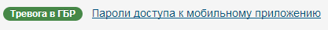
 
• в открывшемся окне найти по названию необходимую ГБР и соответствующий ей пароль доступа:
 
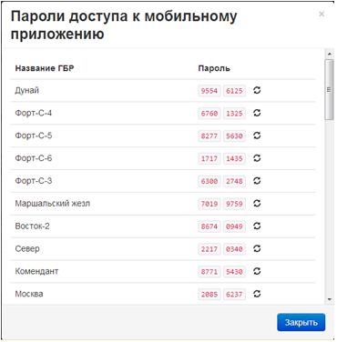

#### Безопасность пароля ГБР

Во избежание несанкционированной авторизации в приложении «Тревога в ГБР» от имени какой-либо группы администратор «Центра охраны» может сменить скомпрометированный пароль доступа. Для этого ему необходимо открыть окно с паролями ГБР в интерфейсе партнера (подробнее см. выше) и нажать на кнопку генерации нового пароля, например:
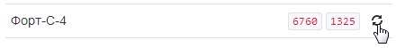
 
Новый пароль вступает в силу немедленно после генерации. Если какое-то приложение использовало в этот момент старый пароль, то произойдет выход из приложения и потребуется повторная авторизация.

## Авторизация в приложении 

Если выполнены все необходимые шаги по установке и настройке программного обеспечения, то можно перейти к работе с приложением.

Для запуска приложения щелкните по иконке на рабочем столе планшетного компьютера.

 

Откроется вкладка авторизации:

Чтобы ГБР могла получать вызовы на тревогу, необходимо выполнить авторизацию в приложении, для чего введите пароль и нажмите на кнопку «Начать работу».

После ввода пароля доступа и нажатия на кнопку «Начать работу» будет проведена проверка правильности введенных данных. Если пароль был введен некорректно, то появится соответствующее предупреждающее сообщение:

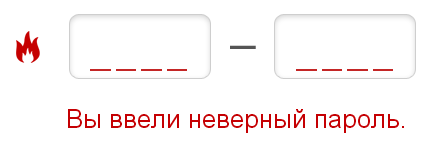

 
Будьте внимательны и повторите ввод пароля.

### Режим ожидания тревоги

После успешной авторизации приложение «Тревога в ГБР» начинает работу, и автоматически включается режим ожидания тревоги:

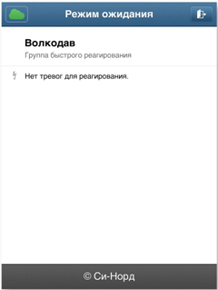
 
Цвет значка в левом верхнем углу вкладки обозначает состояние связи с «Облаком» и с ПО «Центр охраны»: зеленый – связь есть, красный – связь отсутствует.

## Пользовательский интерфейс приложения

В режиме ожидания пользователю доступна только информация о состоянии связи с «Облаком»(см. раздел «Начало работы с приложением») и кнопка для завершения работы с приложением (см. раздел «Выход из приложения»).

После принятия группой вызова на объект становятся доступны основные функции приложения в следующих вкладках:
 
### «Объект» 
Вкладка "Объект" открывается сразу после того, как сотрудник ГБР подтвердит вызов на тревогу

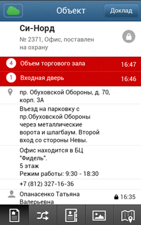

### «Шлейфы»

### «Ответственные»:
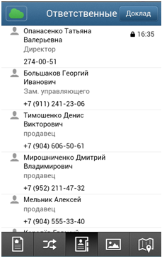
### «Фотографии»
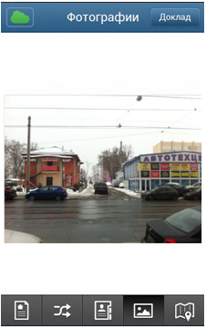
### «Карта»
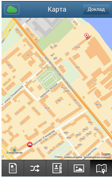
 
Описание представленных на иллюстрациях вкладок см. в разделе «Работа с приложением» настоящего руководства.
 
Переход между вкладками осуществляется при помощи кнопок, расположенных в нижней части экрана:

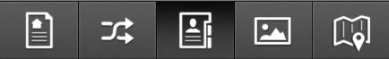
 
В верхней части любой из вкладок в строке заголовка расположена кнопка "Доклад", предназначенная для для подтверждения прибытия на объект (см. раздел «Подтверждение прибытия на объект»). 

 

## Работа с приложением ##

###Реагирование ГБР на тревогу (вызов группы на объект)###

Когда приложение «Тревога в ГБР» находится в режиме ожидания (см. раздел «Начало работы с приложением») на планшетный компьютер ГБР оператором «Центра охраны» может быть передан сигнал тревоги.

При срабатывании охранно-пожарной сигнализации на экране отобразится соответствующее сообщение:

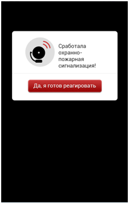
 
Также сообщение о тревоге сопровождается соответствующим звуковым сигналом, который повторяется каждые 5 секунд до тех пор, пока не будет подтвержден вызов на объект.

Нажатие на кнопку «Да, я готов реагировать» означает подтверждение группой выезда на объект.

Немедленно после того, как ГБР подтвердила выезд на тревожный объект, в приложении «Тревога в ГБР» будет автоматически открыта карточка указанного объекта.

----------
Информация о подтверждении выезда на объект, а также любое другое действие ГБР регистрируется в журнале отработки тревоги в «Центре охраны».

----------
В случае если ГБР не подтверждает выезд на объект, то сообщение о тревоге будет отображаться на экране (при этом звуковой сигнал тревоги будет повторяться каждые 5 секунд) либо до отмены вызова ГБР, либо до отмены тревоги, после чего снова автоматически включится режим ожидания.

----------

По прибытии на тревожный объект необходимо уведомить об этом оператора «Центра охраны». Для этого следует нажать на кнопку «Доклад» в верхнем правом углу вкладки:

 
В открывшемся диалоговом окне следует нажать на кнопку «Да, я прибыл на объект»:

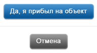
 
Если в процессе реагирования состояние объекта изменится или от объекта будут получены новые тревожные сообщения, то соответствующая информация в карточке объекта будет обновлена (везде в приложении, где эта информация отображается). 

Оператор «Центра охраны» может отменить тревогу или отменить вызов ГБР на объект. В этом случае сообщение об отмене вызова появится на экране планшетного компьютера ГБР:

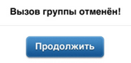
 

Сотруднику ГБР необходимо подтвердить получение информации, нажав на кнопку «Продолжить».

----------
Когда будет подтверждено получение информации об отмене вызова, автоматически включится режим ожидания, карточка объекта будет закрыта.

Если же ГБР не подтверждает получение информации об отмене вызова, то это сообщение будет отображаться на экране до нового вызова на тревожный объект. 

----------

###Просмотр общей информации об объекте###
 

После подтверждения ГБР выезда на тревожный объект на экране планшетного компьютера автоматически будет открыта карточка объекта, содержащая следующую общую информацию:

- номер, название и адрес объекта;
- текущее состояние объекта («поставлен на охрану» или «снят с охраны»);
- информация о шлейфах, по которым получены сигналы тревоги;
- информация об ответственном лице (ФИО и телефоны), выполнившем постановку объекта на охрану или снятие с охраны;
- комментарии, предназначенные специально для ГБР: местоположение объекта, режим его работы, оптимальный способ подъехать к объекту, порядок действий ГБР по прибытии на место.

###Просмотр информации о шлейфах на объекте###
 

Информация на вкладке «Шлейфы» предоставляется для обеспечения сотрудников ГБР полной информацией о происходящем на объекте. Тревожные шлейфы в списке всех шлейфов на объекте выделены красным цветом.

###Просмотр информации о лицах, ответственных за объект###

Просмотр списка лиц, ответственных за объект, т.е. лиц, уполномоченных ставить объект на охрану или снимать объект с охраны, становится доступен при переходе на вкладку «Ответственные»:

  

Справа от записи об ответственном лице, выполнившем последнюю по времени постановку на охрану или снятие объекта с охраны, будет указано время, когда было произведено это действие.

###Просмотр фотографий объекта ###
   
 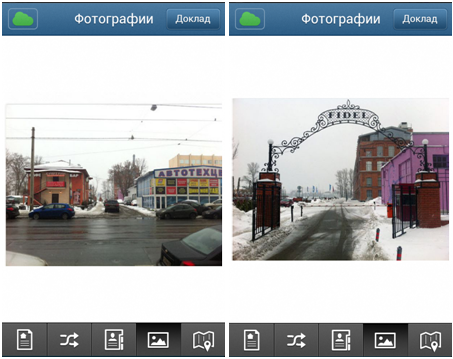 

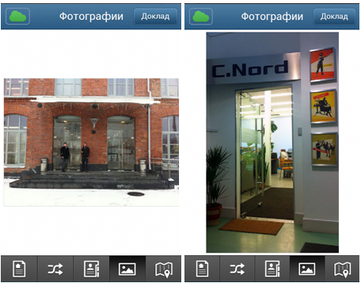
   

Чтобы сотрудники ГБР могли оперативно найти охраняемый объект по указанному адресу, а также в здании, выбрать оптимальную тактику обследования объекта и реагирования на тревогу, необходимо предоставить им визуальную информацию об объекте.

На вкладке "Фотографии" есть возможность посмотреть, как выглядит объект, входы в помещения объекта и т.п.

###Просмотр местоположения объекта на интерактивной карте###
  

На вкладке "Карта" сотрудникам ГБР предоставляется возможность посмотреть местоположение объекта на интерактивной карте Яndex, а также существующие маршруты следования и схемы подъезда к объекту.

##Выход из приложения##
Для того чтобы завершить работу с приложением нажмите на кнопку     в верхней части вкладки «Режим ожидания». 
Работа приложения будет завершена, откроется вкладка авторизации (см. раздел «Начало работы с приложением» настоящего руководства).
